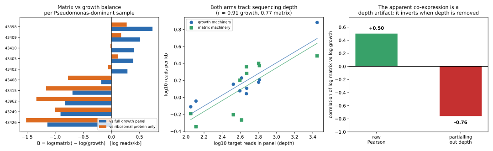

# Acute bacterial biofilm matrix: results

**Question.** Kolpen et al. (Thorax 2022) showed by PNA-FISH imaging that biofilms
dominate *acute* as well as chronic lung infection, and that acute vs chronic
differ in metabolic rate rather than architecture. Their claim implies matrix
production should co-occur with **fast growth** in acute bacterial infection —
the opposite of the classical "biofilm = slow/non-growing" picture. They never
measured gene expression, so the claim is untested transcriptionally.

**Test.** We ask whether matrix-machinery transcripts and growth-machinery
transcripts are co-expressed in acute bacterial pneumonia, using public BALF
metatranscriptomes.

**Answer.** In the samples we can measure, matrix transcripts **are** present —
including the complete alginate operon and Pel/Psl — but the apparent
co-expression with growth machinery is a **sequencing-depth artifact**, not
biology. Once depth is controlled, matrix and growth investment are strongly
*negatively* related. That is the classical trade-off, not Kolpen's combination.
This is a negative result against the novel part of Kolpen's claim, and it rests
on a confound that also invalidates our own earlier positive claim (see
"Correction" below).

---

## Data

`PRJNA1056765` (Tang et al. 2025, *Sci Data*) — 402-patient BALF metagenomics +
metatranscriptomics, host-depleted, 50 bp single-end. 114 bacterial-infection RNA
runs with paired DNA.

Two facts about this dataset drive the whole design:

1. **The non-infectious control arm is dead.** Control samples contain
   essentially no bacterial signal (2 mapped reads), so a bacterial-vs-control
   contrast is impossible. The design must be *within-bacterial*.
2. **The deposited composition table and the RNA reads disagree.** We determined
   genus composition directly from the RNA reads (mapping to a 19-genome
   multi-strain panel) and compared it with the study's own composition table.
   They agree on the dominant genus for only **18/36** samples. Every
   disagreement has the same shape: the table calls the sample
   *Pseudomonas*-dominant, the RNA reads call it *Acinetobacter*-dominant. For
   example `SRR27343990` is 25% *Pseudomonas* / 7.6% *Acinetobacter* in the
   table but 11% *Pseudomonas* / 52% *Acinetobacter* in the reads.

   Because the quantification below is a read-level measurement, the cohort is
   defined **by the reads**, so that selection and measurement share one source.
   Selecting on the table and measuring on the reads is exactly the kind of
   mismatch that produced an earlier wrong answer in this project.

## Method

**Panels.** Per organism (Pseudomonas, Klebsiella), gene sequences extracted from
NCBI GFF3 annotations of three strains each, split into:

| class | content | Pseudomonas | Klebsiella |
|---|---|---|---|
| `matrix` | alg / pel / psl / csg / bcs / ica / cdr / EPS-capsule | 101 | 57 |
| `rp` | ribosomal-protein genes (the canonical Gifford growth marker) | 150 | 102 |
| `og` | other growth genes: replication, division, transcription, translation factors | 241 | 282 |

**Decoy competition.** Conserved genes (`fusA`, `rpoB`, `tuf`, …) map
near-identically across genera. With only the target organism in the index they
have nowhere else to go and are assigned high MAPQ, so they are counted as
target-organism transcripts even when they came from a co-infecting species. We
therefore built `comp_<org>.mmi` = the target panel **plus one reference genome
for each of 34 co-infecting genera** (Salmonella, Delftia, Sphingomonas,
Rhodococcus, Xanthomonas, Burkholderia, Campylobacter, Comamonas, Ralstonia,
Porphyromonas, Fusobacterium, Treponema, Neisseria, Bacteroides, Tannerella,
Prevotella, Mycoplasma, Moraxella, Haemophilus, Streptococcus, E. coli,
Acinetobacter, …). Decoy hits absorb cross-genus reads; only tagged (target)
references are counted.

**One mapping run.** Matrix and growth are quantified from a **single** minimap2
run per sample (`-x sr`, MAPQ ≥ 20), so both arms share identical mapping
conditions. Length normalisation to reads/kb removes the gene-length bias that
would otherwise dominate a panel comparison.

**Statistic.** `B = log(R_matrix) − log(R_growth)` where `R` is reads per kb of
class panel. `B > 0` means matrix machinery is a larger share of the
transcriptome than growth machinery; `B < 0` the reverse. We report `B` against
both growth definitions (`B_rp` and `B_full`) because the choice turns out to
matter, and a read-level permutation CI for each.

**Cohort.** Samples with *Pseudomonas* RNA fraction ≥ 0.5 and ≥ 100 target reads
in the panel: **n = 10**.

---

## Result

### Matrix transcripts are present and diverse

Across the 10-sample cohort, **40 of 101** panel matrix genes are detected
(1,723 reads), including:

- **alginate operon: 16/16 genes** — `algA`, `algB`, `algC`, `algD`, `algE`,
  `algF`, `algG`, `algI`, `algJ`, `algK`, `algL`, `alg8`, `alg44`, `algP`, `algR`,
  `algU`
- **psl: 7/11** — `pslA`, `pslB`, `pslC`, `pslD`, `pslE`, `pslG`, `pslH`
- **pel: 3/7** — `pelA`, `pelB`, `pelD`
- regulators `amrZ`, `algU`, `algR`, `algB`, `cdrB`, `siaA`

The most consistently detected are `algC` (10/10 samples, 294 reads), `amrZ`
(10/10, 97), `algA` (9/10, 705), `algU` (8/10, 158).

This is, to our knowledge, the first direct transcript detection of the alginate
and Pel/Psl machinery in acute bacterial BALF. Existing in-vivo evidence
(Jennings et al. 2021) was immunohistochemistry in chronic CF sputum. Matrix
production in acute infection is therefore not an inference from chronic
disease — the transcripts are there.

### But matrix is not the majority investment, and the balance is equivocal

| metric | median | mean | range | n>0 | sign test | Wilcoxon z |
|---|---|---|---|---|---|---|
| `B_full` (vs full growth panel) | **+0.05** | −0.14 | [−1.14, +0.73] | 5/10 | 1.00 | −0.66 |
| `B_rp` (vs ribosomal protein only) | **−0.41** | −0.53 | [−1.52, +0.27] | 3/10 | 0.34 | −1.58 |

Matrix share of target reads: median 0.416 (range 0.068–0.606).

The two growth definitions give opposite signs. That disagreement is itself the
signal — it means the result is not robust to how "growth" is defined, and an
RP-only growth arm (which the earlier pass used) reports a spurious matrix
"excess".

### The apparent matrix–growth co-expression is a depth artifact

The tempting reading of the raw data is Kolpen-compatible: matrix and growth
rates rise together across samples (Pearson r = **+0.50**). But both arms track
sequencing depth almost perfectly:

| relationship | Pearson r |
|---|---|
| log R_growth vs log depth | **+0.91** |
| log R_matrix vs log depth | **+0.77** |
| log R_matrix vs log R_growth (raw) | +0.50 |
| **log R_matrix vs log R_growth, partialling out depth** | **−0.76** |

Removing depth inverts the association. The reason is a ceiling: at low depth
almost every mapped read is a high-abundance growth transcript, so the growth
rate rises steeply with depth while the matrix rate is floored. The raw positive
correlation is a coverage effect, not co-regulation. The depth-controlled
association is **strongly negative** — the classical matrix/growth trade-off.



---

## Correction to the earlier result in this repository

An earlier pass (`RESULTS.md` at commit `a88fcd9`, archived here as
`RESULTS-firstpass-superseded.md`) reported "matrix/RP median 5.76" and
concluded matrix-ON with growth-weak. The detection claim stands and is
strengthened here (now including the complete alginate operon). **The ratio does
not stand.** It was produced by mapping matrix and growth in **separate**
minimap2 runs against **separate** panels, which conflates panel composition
with mapping behaviour, and it used an **RP-only** growth arm. Measured in a
single shared run with decoy competition and both growth definitions, the same
samples give `B_rp` median −0.41 and `B_full` median +0.05 — no matrix excess,
and a sign that depends on the growth definition. The earlier number should not
be cited.

## Limitations

- **n = 10.** The cohort is small, and it is small because of the dataset, not
  the design: the RNA-derived cohort is only 10 samples deep at ≥100 target
  reads, and depth itself is the limiting variable.
- **Depth is not random.** Depth correlates with matrix share, so even the
  depth-controlled estimate rests on extrapolation across a narrow range. A
  designed experiment with matched depth, or spike-in normalisation, is needed
  for a clean test.
- **rRNA depletion was human-only.** Bacterial rRNA is likely still present,
  which dilutes mRNA and depresses all rates; it does not obviously bias matrix
  vs growth but it lowers power.
- **"Acute" is our framing.** The dataset labels these "Bacterial infection";
  we treat them as acute pneumonia.
- **Acinetobacter is unmeasurable.** It is the RNA-dominant organism in roughly
  half the bacterial samples and it has essentially no characterised matrix
  operon — only 2 matrix genes could be annotated. The organism with the most
  biomass is the one we cannot score. This is a coverage limit, not a biological
  null, and it means our result is a statement about *Pseudomonas*, not about
  acute bacterial pneumonia in general.
- **Bulk averaging erases spatial structure.** Kolpen's claim is about
  architecture and metabolic state of cell aggregates; a bulk ratio cannot
  falsify a claim about spatial organisation. A negative result here means the
  *transcriptional signature* they predict is absent, not that their imaging is
  wrong. A positive result would have been stronger than their imaging; a
  negative one is weaker than a refutation.

## Verdict on Kolpen

The measurable part of the claim — that acute infection shows matrix production
*combined with* fast growth — is **not supported**. Matrix transcripts are
present in acute bacterial BALF, which is consistent with their core
observation that matrix is not chronic-only. But there is no positive
matrix–growth coupling; the depth-controlled association is negative, i.e. the
classical trade-off quadrant. We cannot adjudicate their imaging result, and our
n is small. We can say that the transcriptional signature of
"matrix-ON + growth-FAST" is not visible in these samples.

---

## Files

| file | contents |
|---|---|
| `RESULTS.md` | this document |
| `results_final.csv` | per-sample table (composition, rates, balances, CIs) |
| `analysis_final.json` | full per-sample records |
| `fig_balance.png` | balance distribution, depth confound, partial correlation |
| `build_quant_panel.py` | build per-organism panels |
| `fetch_decoys.py`, `retry_decoys.py` | fetch 34 decoy genomes |
| `quantify3.py` | single-run quantification, classes, balance, permutation CI |
| `rna_composition.py` | RNA-derived genus composition + table comparison |
| `analyze_final.py`, `final_stats.py` | cohort assembly and statistics |
| `make_figure.py` | figure |
| `qp_panels.json`, `rna_genus_mapped.json` | panel + composition records |
| `matrix_gene_census.json` | per-gene detection counts |

## Reproduce

```bash
python3 build_quant_panel.py                 # qp_<org>.fna
python3 fetch_decoys.py && python3 retry_decoys.py
# build competition index
for o in pseu kleb; do
  cat decoyfna/*.fna qp_$o.fna > comp_$o.fna
  minimap2 -x sr -d comp_$o.mmi comp_$o.fna
done
python3 rna_composition.py                   # rna_genus_mapped.json
python3 quantify3.py SRR27343249 pseu 20     # per sample
python3 analyze_final.py && python3 final_stats.py
```
